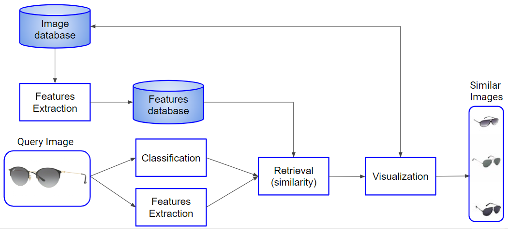

# Content-Based Fashion Image Retrieval #

## Description ##
I have realized a system which allows the retrieve of the similar images given a query image.
I have implemented 4 methods of features extraction:
* SIFT with BOVW
* Daisy
* Deep Method (CNN)
* Color based 

Given the query image:
1. I classify it with trained and fine-tuned Convolutional Neural Network
2. I extract, with these 4 methods, the features of each image contained into the dataset
3. I compute the similarity between the features of the query image and those of the dataset

The features of each image contained into the dataset are previously computed and then saved.

## Solution design ##

